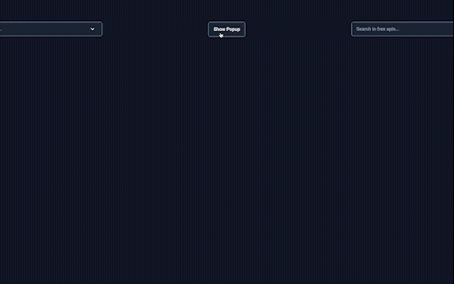

# Autocomplete Search Bar Component

This is a autocomplete search bar component. Data is given by the user.
Data can be customized by user's selections. It can be fetched from an API or static file. In this example, data is taken from an API.
Suggestions can be opened or closed by click event. 
User can change properties which are explained in props.

<p align="center" >
  
</p>

## Datas

A part of data which is used for this example is shown below.


```bash
{"count":1425,"entries":[{"API":"AdoptAPet","Description":"Resource to help get pets adopted","Auth":"apiKey","HTTPS":true,"Cors":"yes","Link":"https://www.adoptapet.com/public/apis/pet_list.html","Category":"Animals"},{"API":"Axolotl","Description":"Collection of axolotl pictures and facts","Auth":"","HTTPS":true,"Cors":"no","Link":"https://theaxolotlapi.netlify.app/","Category":"Animals"},{"API":"Cat Facts","Description":"Daily cat facts","Auth":"","HTTPS":true,"Cors":"no","Link":"https://alexwohlbruck.github.io/cat-facts/","Category":"Animals"},{"API":"Cataas","Description":"Cat as a service (cats pictures and gifs)","Auth":"","HTTPS":true,"Cors":"no","Link":"https://cataas.com/","Category":"Animals"},{"API":"Cats","Description":"Pictures of cats from Tumblr","Auth":"apiKey","HTTPS":true,"Cors":"no","Link":"https://docs.thecatapi.com/","Category":"Animals"},{"API":"Dog Facts","Description":"Random dog facts","Auth":"","HTTPS":true,"Cors":"yes","Link":"https://dukengn.github.io/Dog-facts-API/","Category":"Animals"},{"API":"Dog Facts","Description":"Random facts of Dogs","Auth":"","HTTPS":true,"Cors":"yes","Link":"https://kinduff.github.io/dog-api/","Category":"Animals"},{"API":"Dogs","Description":"Based on the Stanford Dogs Dataset","Auth":"","HTTPS":true,"Cors":"yes","Link":"https://dog.ceo/dog-api/","Category":"Animals"},
```
## Customizable Options

| Props                  | Type    | Description                                            | Default Value                                          |
|------------------------|---------|--------------------------------------------------------|--------------------------------------------------------|
| options                | Array   | You can customize the options by changing data     |                                                         |
| searchValue            | String  | You can search anything .   | ""                                                     |
| textKey                | Function| You can choose data by changing textKey                    |                                                        |
| isLoading              | Boolean | You can change the value                |                                                        |
| loadingMsg             | String  | You can change the message when suggestions are loading                | "Options loading."                                     |
| noOptionMsg            | Function| You can customize the message when suggestions are not found          | "Your search-${searchText}- did not match any options" |
| label                  | String  | You can customize the text which in input placeholder              | "Type for search"                                      |
| matchComponent         | String  | You can customize the matched options by changing matchComponent.        | "b".                                                   |
| inputColor             | String  | You can change input area background color.            | "#1E293B"                                              |
| optionsColor           | String  | You can change options area background color.              | "#1E293B"                                              |
| iconColor              | String  | You can change icon background background color.       | "#fff"                                                 |
| infoColor              | String  | You can change the accept button background color.  | "#1E293B"                                              |

# Pop-up Component

This is a pop-up component which can be customized by user. Pop-up can be opened by user by clicking the button. In order to close pop-up, user can
click on "x" button or "close" button.

This is the default settings for pop-up.
<p align="center" >
  
</p>

## Datas
User can use data which they need in pop-up component. For example, data can be video, image, text etc. 
In this example, text is used as data in pop-up.


## Instructions
In order to use components, it needs to be installed all dependencies.
 
-  npm install
